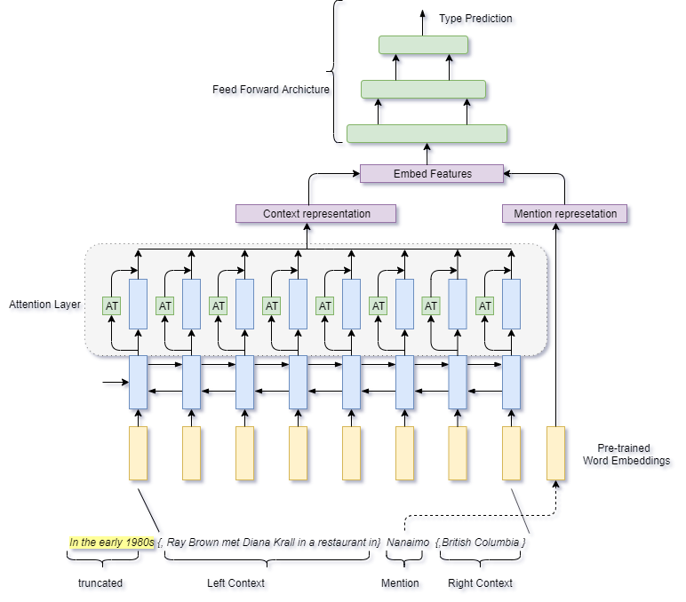

### Fine Grain Entity Type Prediction with Hinge Loss

<p align="center">

</p>

### Results
##### 1. Results on OntoNotes dataset
| Model Type             | Strict F1 | Loose Micro | Loose Macro |
|------------------------------------------|-----------|-------------|-------------|
| Proposed Method(w/o HandCrafted features | 52.89     | 61.56       | 69.21       |
| Proposed Method(w/ HandCrafted features  | 53.22     | 61.59       | 69.36       |

##### 2. Results on FIGER dataset
| Model Type              | Strict F1 | Loose Micro | Loose Macro |
|------------------------------------------|-----------|-------------|-------------|
| Proposed Method(w/o HandCrafted features | 61.10     | 75.70       | 78.95       |
| Proposed Method(w/ HandCrafted features  | 62.16     | 76.12       | 79.69       |

### Download and preprocess the dataset
```bash
sh preprocess.sh
```

### Training the Fine Grain Entity Type Model
```python
python train_fner_attn.py --help
usage: train_fner_attn.py [-h] [--feature] [--no-feature] [--hier] [--no-hier]
                          [--model_name MODEL_NAME]
                          [--data_location DATA_LOCATION] [--exp_num EXP_NUM]
                          [--exp_info EXP_INFO] [--epochs EPOCHS]
                          [--keep_probs KEEP_PROBS]
                          [--learning_rate_fner LEARNING_RATE_FNER]
                          [--lstm_layer LSTM_LAYER]
                          [--steps_per_epoch_fner STEPS_PER_EPOCH_FNER]
                          [--doc_2_vec DOC_2_VEC] [--option OPTION]
                          {figer,gillick}
                          {averaging,lstm,attentive,sentence-attentive,attentive_figet,hier-attention}

positional arguments:
  {figer,gillick}       dataset to train model
  {averaging,lstm,attentive,sentence-attentive,attentive_figet,hier-attention}
                        context encoder to use in model

optional arguments:
  -h, --help            show this help message and exit
  --feature
  --no-feature
  --hier
  --no-hier
  --model_name MODEL_NAME
                        Model name
  --data_location DATA_LOCATION
                        data location of the KGE data
  --exp_num EXP_NUM     experiment number
  --exp_info EXP_INFO   experiment information for logging
  --epochs EPOCHS       Number of Epochs
  --keep_probs KEEP_PROBS
                        LSTM dropout
  --learning_rate_fner LEARNING_RATE_FNER
                        task kge learning rate
  --lstm_layer LSTM_LAYER
                        lstm layer size
  --steps_per_epoch_fner STEPS_PER_EPOCH_FNER
                        steps per epoch for FNER task
  --doc_2_vec DOC_2_VEC
                        enable doc_2_vec
  --option OPTION       Training of the FNER data

```
```python
python test_fner_attn.py --help
usage: test_fner_attn.py [-h] [--feature] [--no-feature] [--hier] [--no-hier]
                         [--model_name MODEL_NAME]
                         [--data_location DATA_LOCATION] [--exp_num EXP_NUM]
                         [--exp_info EXP_INFO] [--epochs EPOCHS]
                         [--keep_probs KEEP_PROBS]
                         [--learning_rate_fner LEARNING_RATE_FNER]
                         [--lstm_layer LSTM_LAYER]
                         [--steps_per_epoch_fner STEPS_PER_EPOCH_FNER]
                         [--doc_2_vec DOC_2_VEC] [--option OPTION]
                         {figer,gillick}
                         {averaging,lstm,attentive,sentence-attentive,attentive_figet,hier-attention}

positional arguments:
  {figer,gillick}       dataset to train model
  {averaging,lstm,attentive,sentence-attentive,attentive_figet,hier-attention}
                        context encoder to use in model

optional arguments:
  -h, --help            show this help message and exit
  --feature
  --no-feature
  --hier
  --no-hier
  --model_name MODEL_NAME
                        Model name
  --data_location DATA_LOCATION
                        data location of the KGE data
  --exp_num EXP_NUM     experiment number
  --exp_info EXP_INFO   experiment information for logging
  --epochs EPOCHS       Number of Epochs
  --keep_probs KEEP_PROBS
                        LSTM dropout
  --learning_rate_fner LEARNING_RATE_FNER
                        task kge learning rate
  --lstm_layer LSTM_LAYER
                        lstm layer size
  --steps_per_epoch_fner STEPS_PER_EPOCH_FNER
                        steps per epoch for FNER task
  --doc_2_vec DOC_2_VEC
                        enable doc_2_vec
  --option OPTION       Training of the FNER data
```
