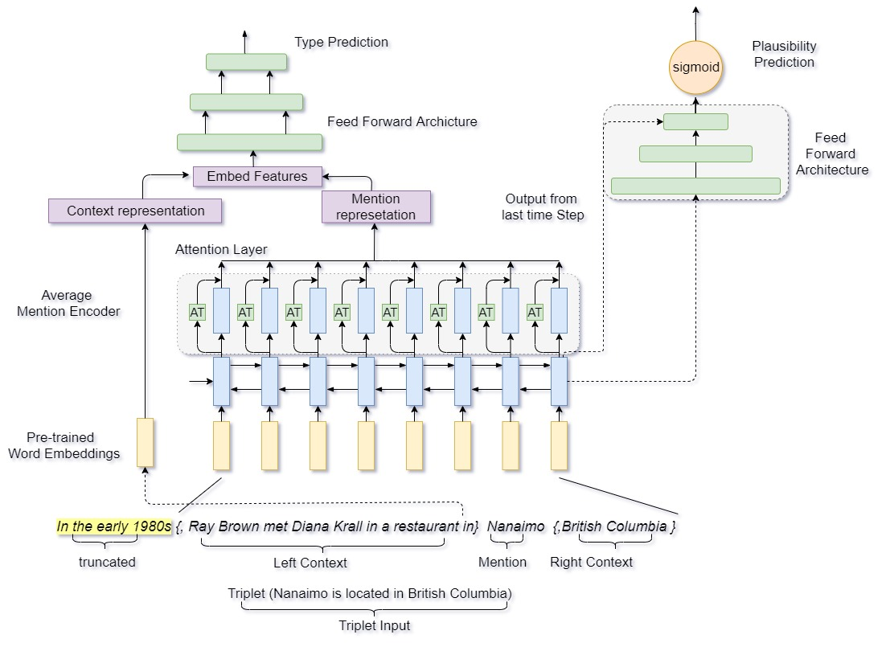

# Jointly Learning Knowledge graoh Embedding with Fine Grain Entity types

## Results
#### Joint Learning results trained on the combination of dataset for used training baseline knowledge graph embedding architecture and fine grain entity type prediction models
| Dataset KGE | Dataset FNER | Strict F1 | Macro F1 | Micro -F1 | Accuracy | AUROC | AUCPR | F1   | Precision | Recall |
|-------------|--------------|-----------|----------|-----------|----------|-------|-------|------|-----------|--------|
| FB13 (baseline)       |              |           |          |           | 90.21    | 0.96  | 0.95  | 0.9  | 0.89      | 0.91   |
| WN11 (baseline)        |              |           |          |           | 88.3     | 0.94  | 0.93  | 0.88 | 0.85      | 0.91   |
| FB15K (baseline)      |              |           |          |           | 94.73    | 0.98  | 0.97  | 0.94 | 0.92      | 0.97   |
|             | OntoNotes (baseline)   | 53.22     | 69.36    | 61.65     |          |       |       |      |           |        |
|             | FIGER (baseline)        | 61.1      | 78.95    | 75.7      |          |       |       |      |           |        |
| FB15k       | OntoNotes    | 53.33     | 70.47    | 62.95     | 93.43    | 0.97  | 0.97  | 0.93 | 0.9       | 0.97   |
| FB15K       | FIGER        | 60.21     | 74.67    | 78.09     | 94.42    | 0.97  | 0.98  | 0.94 | 0.91      | 0.97   |
| WN11        | OntoNotes    | 52.79     | 69.12    | 61.62     | 87.61    | 0.93  | 0.94  | 0.88 | 0.83      | 0.94   |
| WN11        | FIGER        | 61.45     | 78.69    | 75.04     | 88.47    | 0.94  | 0.93  | 0.88 | 0.86      | 0.9    |
| FB13        | OntoNotes    | 53.34     | 70.81    | 63.44     | 89.79    | 0.96  | 0.96  | 0.9  | 0.87      | 0.93   |
| FB13        | FIGER        | 59.69     | 78.91    | 75.34     | 89.78    | 0.96  | 0.96  | 0.9  | 0.87      | 0.93   |

#### Joint Learning architecture results on WikiAuto and WikiMan Datasets
| Dataset  | Strict-F1 | Macro-F1 | Micro-F1 |
|----------|-----------|----------|----------|
| WikiAUTO | 46.18     | 72.78    | 76.022   |
| WikiMAN  | 25.00     | 73.40    | 74.43    |
