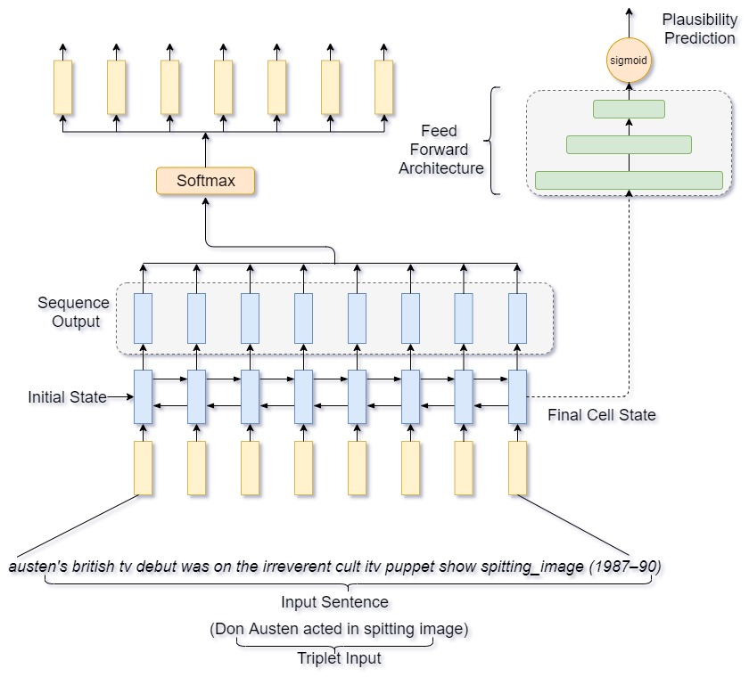

# Jointly Learning knowledge graph embedding with language model

<p align="center">

</p>


## Benchmark Performance
### 1. Performance on vocab size 70k
| Model            | Perplexity | Accuracy |
|------------------|------------|----------|
| LM70k (baseline) | 157.21     | -        |
| KGE70k(baseline) | -          | 94.22    |
| Joint 70k        | 109.21     | 93.42    |

### 2. Performance on vocab size 30k
| Model             | Perplexity | Accuracy |
|-------------------|------------|----------|
| LM30k (baseline)  | 70.32      |          |
| KGE30k (baseline) | -          | 92.44    |
| Joint30k          | 49.74      | 93.3     |


### Sample sentence generated from joint model and baseline models
| Original        	| joshua michael josh peck born november 10 1986 is an american actor he is best known for playing josh nichols in the nickelodeon liveaction sitcom drake & josh he began his career as a child actor in the late 1990s and early 2000s and became known to young audiences after his role on the amanda show h<br>e has since acted in films such as mean creek drillbit taylor the unk unk and red dawn along with voicing eddie in the ice age franchise he currently voices casey jones in teenage mutant ninja turtles and stars as gerald in a lead role with john unk in the series unk                                         	|
|-----------------	|---------------------------------------------------------------------------------------------------------------------------------------------------------------------------------------------------------------------------------------------------------------------------------------------------------------------------------------------------------------------------------------------------------------------------------------------------------------------------------------------------------------------------------------------------------------------------------------------------------------------------------------	|
| Joint_model_70K 	| michael thomas scott obe born december 27 1975 is an american actor he is best known for playing michael wilson on the nbc television sitcom malcolm and cody he started his career as a child actor in the late 1950s and early 1980s he became popular for his audiences for his debut in the television show he h<br>as also appeared in films such as woody guy john and presents bill man and the dwarf and with john roles in the new series episode he also stars john davenport in the mutant ninja turtles also starred as well in the supporting role in the carpenter in the                                               	|
| Joint_model_30k 	| james lee steve unk born may 7 1985 is an american actor he is best known for playing james unk on the abc network series unk & unk he started his career as a voice actor in the film 1940s and early 1970s he became known for international age for a career on the tv unk he has also appeared in films such as <br>the boy alice and and bill unk and the man along with unk unk in the new house murder he also portrays as unk in teenage mutant ninja turtles and stars as well in the recurring role in unk unk in the                                                                                                       	|
| LM_70K          	| christopher francis john olsen born august 26 1982 is an american actor he is best known for playing wendy smith in the nbc series series christopher brother ferb he began his career as a character actor in the late 1960s and early 1990s he was known to the audiences for his role on the television show he h<br>as also starred in films such as hedda michael and and (@@sheffield a-team man and the ribbon along with michael him in the film stargate which she also portrays dylan robinnightwing in teenage mutant ninja turtles and stars as well in the supporting role in vincent miller in the incredibles homeland 	|
| LM_30K          	| christopher lee gregory unk born may 19 1965 is an american actor he is best known for playing chuck unk on the cbs original series malcolm & order he began his career as a television artist in the late 1990s and early 1970s he became familiar for the audiences for his role in the same show he has also star<br>red in films such as cold joan and and unk bill unk and late age playing with unk roles in the transformers anime of and provided plays buzz hicks and the mutant ninja turtles currently appeared of unk in the small role of the wayne on the sitcom unk                                                    	|


## Training the model

Download the dataset from the link below

[KGE_LM_data](https://drive.google.com/drive/folders/1VbA3zgpbuWIQGlk0zTEfqg9DkaqoO3xh?usp=sharing) 

store the data in data directory here

```python
CUDA_VISIBLE_DEVICES=0,1,2 nohup python train_kge_lm.py --model_name=lm_kge_joint --dataset_kge=wikifacts 
--data_location_kge=data/KGE_dataset/ --data_location_lm=data/LM_dataset/ --exp_num=01 
--exp_info="joint model wikifact with limit 1" --epochs=30 --learning_rate_lm=1e-3 
--learning_rate_kge=1e-3 --option=1 --steps_per_epoch_kge=500 
--steps_per_epoch_lm=200 --joint_opt=False --task=INIT
```

## Testing the joint model

```python
CUDA_VISIBLE_DEVICES=0,1,2 nohup python test_kge_lm.py --model_name=lm_kge_joint 
--dataset_kge=wikifacts --data_location_kge=data/KGE_dataset/ --data_location_lm=data/LM_dataset/ 
--exp_num=01 --exp_info="test joint model wikifact" --option=1 --joint_opt=False --task=INIT
```

### Training baseline Language model
```python
python train_lm.py --help
usage: train_lm.py [-h] [--data_location DATA_LOCATION]
                   [--data_location_lm DATA_LOCATION_LM]
                   [--model_name MODEL_NAME] [--exp_num EXP_NUM]
                   [--exp_info EXP_INFO] [--learning_rate_lm LEARNING_RATE_LM]
                   [--option OPTION] [--lstm_layer LSTM_LAYER]
                   [--steps_per_epoch_lm STEPS_PER_EPOCH_LM] [--epochs EPOCHS]
                   [--keep_probs KEEP_PROBS] [--vocab_size VOCAB_SIZE]

optional arguments:
  -h, --help            show this help message and exit
  --data_location DATA_LOCATION
                        data location of the LM data
  --data_location_lm DATA_LOCATION_LM
                        data location of the LM data
  --model_name MODEL_NAME
                        Model name
  --exp_num EXP_NUM     experiment number
  --exp_info EXP_INFO   experiment information for logging
  --learning_rate_lm LEARNING_RATE_LM
                        task LM learning rate
  --option OPTION       Training of the LM data
  --lstm_layer LSTM_LAYER
                        lstm layer size
  --steps_per_epoch_lm STEPS_PER_EPOCH_LM
                        steps per epoch for LM task
  --epochs EPOCHS       Number of Epochs
  --keep_probs KEEP_PROBS
                        LSTM dropout
  --vocab_size VOCAB_SIZE
                        vocabulary_size (30 or 70
```
### Testing the joint learning model
```python
python test_lm.py --help
usage: test_lm.py [-h] [--data_location DATA_LOCATION]
                  [--data_location_lm DATA_LOCATION_LM]
                  [--model_name MODEL_NAME] [--exp_num EXP_NUM]
                  [--exp_info EXP_INFO] [--option OPTION]
                  [--lstm_layer LSTM_LAYER] [--epochs EPOCHS]
                  [--keep_probs KEEP_PROBS] [--vocab_size VOCAB_SIZE]

optional arguments:
  -h, --help            show this help message and exit
  --data_location DATA_LOCATION
                        data location of the LM data
  --data_location_lm DATA_LOCATION_LM
                        data location of the LM data
  --model_name MODEL_NAME
                        Model name
  --exp_num EXP_NUM     experiment number
  --exp_info EXP_INFO   experiment information for logging
  --option OPTION       Training of the FNER data
  --lstm_layer LSTM_LAYER
                        lstm layer size
  --epochs EPOCHS       Number of Epochs
  --keep_probs KEEP_PROBS
                        LSTM dropout
  --vocab_size VOCAB_SIZE
                        vocabulary_size (30 or 70)
```
### Training and testing Baseline KGE model

```python
python train_kge.py --help
usage: train_kge.py [-h] [--dataset_kge DATASET_KGE] [--model_name MODEL_NAME]
                    [--data_location_kge DATA_LOCATION_KGE]
                    [--exp_num EXP_NUM] [--exp_info EXP_INFO]
                    [--epochs EPOCHS] [--learning_rate_kge LEARNING_RATE_KGE]
                    [--lstm_layer LSTM_LAYER] [--option OPTION]
                    [--steps_per_epoch_kge STEPS_PER_EPOCH_KGE]
                    [--balance BALANCE] [--hidden_units_1 HIDDEN_UNITS_1]
                    [--hidden_units_2 HIDDEN_UNITS_2]
                    [--hidden_units_3 HIDDEN_UNITS_3]
                    [--hidden_units_4 HIDDEN_UNITS_4] [--keep_prob KEEP_PROB]
                    [--task TASK] [--vocab_size VOCAB_SIZE]

optional arguments:
  -h, --help            show this help message and exit
  --dataset_kge DATASET_KGE
                        KGE dataset(name)
  --model_name MODEL_NAME
                        Model name
  --data_location_kge DATA_LOCATION_KGE
                        data location of the KGE data
  --exp_num EXP_NUM     experiment number
  --exp_info EXP_INFO   experiment information for logging
  --epochs EPOCHS       Number of Epochs
  --learning_rate_kge LEARNING_RATE_KGE
                        task KGE learning rate
  --lstm_layer LSTM_LAYER
                        lstm layer size
  --option OPTION       evaluation of data
  --steps_per_epoch_kge STEPS_PER_EPOCH_KGE
                        steps per epoch for KGE task
  --balance BALANCE     KGE training weights
  --hidden_units_1 HIDDEN_UNITS_1
                        KGE hidden unit 1
  --hidden_units_2 HIDDEN_UNITS_2
                        KGE hidden unit 2
  --hidden_units_3 HIDDEN_UNITS_3
                        KGE hidden unit 3
  --hidden_units_4 HIDDEN_UNITS_4
                        KGE hidden unit 4
  --keep_prob KEEP_PROB
                        LSTM dropout
  --task TASK           Task to run - INIT, KGE, LM
  --vocab_size VOCAB_SIZE
                        vocabulary_size (30 or 70)

```
