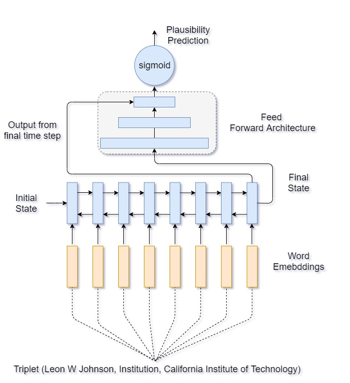

# Knowledge Graph Embedding as Language Model

<p align="center">

</p>

## Results on Triple Classification Task using BiLSTM based KGE_asLM model
| Method      | WN11 | FB13  | Avg   |
|-------------|------|-------|-------|
| NTN         | 86.2 | 90.0  | 88.1  |
| TransE      | 75.9 | 81.5  | 78.7  |
| TransH      | 78.8 | 83.3  | 81.1  |
| TransR      | 85.9 | 82.5  | 84.2  |
| TransD      | 86.4 | 89.1  | 87.8  |
| TEKE        | 86.1 | 84.2  | 85.2  |
| TransG      | 87.4 | 87.3  | 87.4  |
| TransSparse | 86.4 | 88.2  | 87.4  |
| DistMult    | 88.9 | 89.0  | 89.0  |
| AATE        | 88.0 | 87.2  | 87.6  |
| ConvKB      | 87.6 | 88.8  | 88.2  |
| DOLORES     | 87.5 | 89.3  | 88.4  |
| KGE as LM   | 88.3 | 90.21 | 89.44 |

### Download and preprocess the dataset
```bash
sh preprocess.sh
```

### Training and testing BiLSTM based KGE_asLM model
```python
 python train_bilstm.py --help
usage: train_bilstm.py [-h] [--model_name MODEL_NAME]
                       [--data_location DATA_LOCATION] [--exp_num EXP_NUM]
                       [--exp_info EXP_INFO] [--epochs EPOCHS]
                       [--lstm_size LSTM_SIZE] [--keep_prob KEEP_PROB]
                       [--weight WEIGHT] [--train_file_name TRAIN_FILE_NAME]
                       [--batch_size BATCH_SIZE] [--pad_head PAD_HEAD]
                       [--pad_rel PAD_REL] [--pad_tail PAD_TAIL]
                       [--data_set_type DATA_SET_TYPE]
                       [--final_output FINAL_OUTPUT]
                       [--average_input AVERAGE_INPUT] [--decay DECAY]
                       [--learning_rate LEARNING_RATE] [--splits SPLITS]

optional arguments:
  -h, --help            show this help message and exit
  --model_name MODEL_NAME
                        saved model filename
  --data_location DATA_LOCATION
                        data location
  --exp_num EXP_NUM     training exp num
  --exp_info EXP_INFO   experiment info
  --epochs EPOCHS       Number of epochs to train
  --lstm_size LSTM_SIZE
                        LSTM dimension and layer
  --keep_prob KEEP_PROB
                        Dropout probability
  --weight WEIGHT       loss weight
  --train_file_name TRAIN_FILE_NAME
                        insert train file name
  --batch_size BATCH_SIZE
                        train batch size
  --pad_head PAD_HEAD   padding head length
  --pad_rel PAD_REL     padding tail length
  --pad_tail PAD_TAIL   padding rel length
  --data_set_type DATA_SET_TYPE
                        KGE dataset type
  --final_output FINAL_OUTPUT
                        final output
  --average_input AVERAGE_INPUT
                        average input
  --decay DECAY         loss decay
  --learning_rate LEARNING_RATE
                        train learning rate
  --splits SPLITS       BiLSTM embedding split
```
### Training and test LSTM based KGE_asLM model
```python
 python train_lstm.py --help
usage: train_lstm.py [-h] [--model_name MODEL_NAME]
                     [--data_location DATA_LOCATION] [--exp_num EXP_NUM]
                     [--exp_info EXP_INFO] [--epochs EPOCHS]
                     [--lstm_size LSTM_SIZE] [--keep_prob KEEP_PROB]
                     [--weight WEIGHT] [--train_file_name TRAIN_FILE_NAME]
                     [--batch_size BATCH_SIZE] [--pad_head PAD_HEAD]
                     [--pad_rel PAD_REL] [--pad_tail PAD_TAIL]
                     [--data_set_type DATA_SET_TYPE]
                     [--final_output FINAL_OUTPUT]
                     [--average_input AVERAGE_INPUT] [--decay DECAY]
                     [--learning_rate LEARNING_RATE] [--splits SPLITS]

optional arguments:
  -h, --help            show this help message and exit
  --model_name MODEL_NAME
                        saved model filename
  --data_location DATA_LOCATION
                        data location
  --exp_num EXP_NUM     training exp num
  --exp_info EXP_INFO   experiment info
  --epochs EPOCHS       Number of epochs to train
  --lstm_size LSTM_SIZE
                        LSTM dimension and layer
  --keep_prob KEEP_PROB
                        Dropout probability
  --weight WEIGHT       loss weight
  --train_file_name TRAIN_FILE_NAME
                        insert train file name
  --batch_size BATCH_SIZE
                        train batch size
  --pad_head PAD_HEAD   padding head length
  --pad_rel PAD_REL     padding tail length
  --pad_tail PAD_TAIL   padding rel length
  --data_set_type DATA_SET_TYPE
                        KGE dataset type
  --final_output FINAL_OUTPUT
                        final output
  --average_input AVERAGE_INPUT
                        average input
  --decay DECAY         loss decay
  --learning_rate LEARNING_RATE
                        train learning rate
  --splits SPLITS       LSTM embedding split
```


