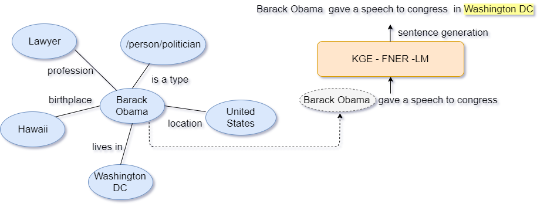

# On the Complmentary Nature of Knowledge Graph Embedding, Fine Grain Entity Types and Language Modeling:

## Abstract:
We demonstrate the complementary natures of neural knowledge graph embedding, finegrain entity type prediction, and neural language modeling. We show that a language
model-inspired knowledge graph embedding approach yields both improved knowledge graph embeddings and fine-grain entity type
representations. Our work also shows that jointly modeling both structured knowledge tuples and language improves both.

<p align="center">

</p>


## Implementation
The implementation of the proposed work span into following section: \
    - Knowledge Graph Embedding as Language Model (KGE_LM) \
    - Neural Fine Grain Entity Type Recognition (FNETR) \
    - Jointly Learning KGE and FNER (KGE_FNER)\
    - Joint Learning KGE and LM (KGE_LM)
    
## Citation
The source code and data in this repository aims at facilitating the study of knowledge graph embedding and fine grain entity type prediction with contextual representation along with Language Modeling task. If you use the code/data, please cite it as follows:
```shell script
@inproceedings{patel-ferraro-2020-complementary,
    title = "On the Complementary Nature of Knowledge Graph Embedding, Fine Grain Entity Types, and Language Modeling",
    author = "Patel, Rajat  and
      Ferraro, Francis",
    booktitle = "Proceedings of Deep Learning Inside Out (DeeLIO): The First Workshop on Knowledge Extraction and Integration for Deep Learning Architectures",
    month = nov,
    year = "2020",
    address = "Online",
    publisher = "Association for Computational Linguistics",
    url = "https://www.aclweb.org/anthology/2020.deelio-1.11",
    doi = "10.18653/v1/2020.deelio-1.11",
    pages = "89--99",
    abstract = "We demonstrate the complementary natures of neural knowledge graph embedding, fine-grain entity type prediction, and neural language modeling. We show that a language model-inspired knowledge graph embedding approach yields both improved knowledge graph embeddings and fine-grain entity type representations. Our work also shows that jointly modeling both structured knowledge tuples and language improves both.",
}
```


  
